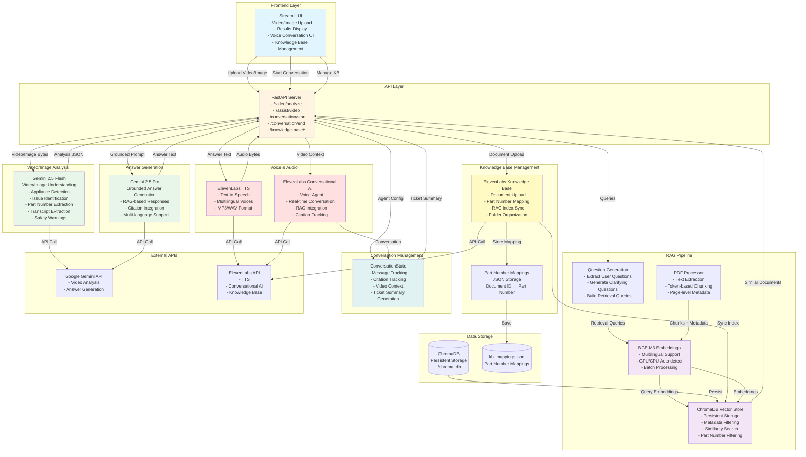

# Technical Architecture Diagram - Video AI Support System POC

## نظرة عامة على النظام (System Overview)

هذا النظام هو نظام دعم تقني ذكي يستخدم الذكاء الاصطناعي لتحليل الفيديوهات/الصور وتقديم إرشادات إصلاح مبنية على قاعدة معرفة تقنية.

---

## رسم تخطيطي للبنية التقنية (Technical Architecture Diagram)



---

## المكونات التقنية الرئيسية (Key Technical Components)

### 1. **Frontend - Streamlit UI**
- **التقنية**: Streamlit
- **الميزات**:
  - رفع الفيديوهات/الصور
  - عرض النتائج مع الاقتباسات
  - واجهة المحادثة الصوتية
  - إدارة قاعدة المعرفة
  - دعم متعدد اللغات (عربي/إنجليزي)

### 2. **Backend API - FastAPI**
- **التقنية**: FastAPI
- **Endpoints**:
  - `POST /video/analyze` - تحليل الفيديو/الصورة
  - `POST /assist/video` - خط المساعدة الكامل (تحليل + RAG + إجابة)
  - `POST /conversation/start` - بدء محادثة صوتية
  - `POST /conversation/end` - إنهاء المحادثة وإنشاء تذكرة
  - `GET/POST/DELETE /knowledge-base/documents` - إدارة المستندات

### 3. **Video/Image Analysis - Gemini AI**
- **النموذج**: Gemini 2.5 Flash
- **القدرات**:
  - تحديد نوع الجهاز (Appliance Type)
  - استخراج الماركة/الموديل
  - **استخراج Part Number** من الفيديو/الصورة
  - **توقع Part Number** إذا لم يكن مرئياً
  - استخراج Transcript من الصوت
  - تحديد المشكلة (Issue Summary)
  - تحديد الأسباب المحتملة (Root Causes)
  - خطوات الإصلاح المقترحة
  - تحذيرات السلامة
  - أسئلة المتابعة

### 4. **RAG System (Retrieval-Augmented Generation)**

#### 4.1 **Embeddings - BGE-M3**
- **النموذج**: BAAI/bge-m3
- **الميزات**:
  - دعم متعدد اللغات (Multilingual)
  - اكتشاف تلقائي لـ GPU/CPU
  - معالجة بالدفعات (Batch Processing)
  - أبعاد: 1024

#### 4.2 **Vector Store - ChromaDB**
- **التقنية**: ChromaDB (Persistent)
- **الميزات**:
  - تخزين مستمر (Persistent Storage)
  - فلترة حسب Part Number
  - بحث بالتشابه (Similarity Search)
  - Metadata: `part_number`, `source_file`, `page_number`

#### 4.3 **PDF Processing**
- **التقنية**: PyPDF + Tiktoken
- **الميزات**:
  - استخراج النص من PDF
  - تقسيم النص إلى Chunks (Token-based)
  - حفظ Metadata لكل Chunk (صفحة، ملف، Part Number)

#### 4.4 **Question Generation**
- **الميزات**:
  - استخراج الأسئلة من Transcript
  - توليد أسئلة توضيحية
  - بناء استعلامات البحث

### 5. **Answer Generation - Gemini AI**
- **النموذج**: Gemini 2.5 Pro
- **الميزات**:
  - إجابات مبنية على RAG
  - دمج الاقتباسات (Citations)
  - دعم متعدد اللغات
  - خطوات إصلاح عملية

### 6. **Text-to-Speech - ElevenLabs**
- **التقنية**: ElevenLabs TTS API
- **الميزات**:
  - تحويل النص إلى كلام
  - دعم متعدد اللغات (عربي/إنجليزي)
  - تنسيقات: MP3, WAV
  - أصوات متعددة اللغات

### 7. **Voice Conversation - ElevenLabs Conversational AI**
- **التقنية**: ElevenLabs Conversational AI 2.0
- **الميزات**:
  - محادثة صوتية في الوقت الفعلي
  - تكامل مع Knowledge Base (RAG)
  - تتبع الاقتباسات
  - وضعين: Troubleshooting / Wrap-up
  - إنشاء ملخص التذكرة (Ticket Summary)

### 8. **Knowledge Base Management - ElevenLabs KB**
- **التقنية**: ElevenLabs Knowledge Base API
- **الميزات**:
  - رفع المستندات مع Part Number
  - تنظيم المستندات في Folders
  - مزامنة RAG Index
  - Mapping بين Document ID و Part Number

### 9. **Conversation Management**
- **التقنية**: ConversationState (Custom)
- **الميزات**:
  - تتبع الرسائل (Messages)
  - تتبع الاقتباسات المستخدمة
  - حفظ سياق الفيديو
  - توليد ملخص المحادثة
  - إنشاء Ticket Summary للـ CRM

---

## تدفق البيانات (Data Flow)

### 1. **Video/Image Analysis Flow**
```
User Upload → FastAPI → Gemini 2.5 Flash → Analysis JSON
  ↓
Extract: Appliance Type, Brand, Part Number, Issue, Transcript
  ↓
Predict Part Number if not extracted
  ↓
Return to User
```

### 2. **Full Assistance Flow (RAG Pipeline)**
```
Video Analysis → Question Generation → Build Queries
  ↓
BGE-M3 Embeddings → ChromaDB Search (filtered by Part Number)
  ↓
Retrieve Relevant Documents → Compose Grounded Prompt
  ↓
Gemini 2.5 Pro → Generate Answer with Citations
  ↓
ElevenLabs TTS → Audio Output (Optional)
  ↓
Return to User
```

### 3. **Voice Conversation Flow**
```
Video Analysis → Initialize Agent with Context
  ↓
ElevenLabs Agent → Real-time Voice Conversation
  ↓
Agent uses Knowledge Base (RAG) → Provides Answers with Citations
  ↓
ConversationState tracks Messages & Citations
  ↓
End Conversation → Generate Ticket Summary
  ↓
Return Ticket Summary for CRM Integration
```

### 4. **Knowledge Base Upload Flow**
```
PDF Upload → Extract Text & Chunk
  ↓
BGE-M3 Embeddings → ChromaDB Storage
  ↓
Upload to ElevenLabs KB → Store Part Number Mapping
  ↓
Sync RAG Index → Ready for Retrieval
```

---

## التقنيات المستخدمة (Technologies Stack)

### **AI/ML Models**
- **Gemini 2.5 Flash** - Video/Image Analysis
- **Gemini 2.5 Pro** - Answer Generation
- **BGE-M3** - Multilingual Embeddings (1024 dimensions)

### **Vector Database**
- **ChromaDB** - Persistent Vector Store

### **APIs & Services**
- **Google Gemini API** - Video analysis & text generation
- **ElevenLabs API** - TTS, Conversational AI, Knowledge Base

### **Backend Framework**
- **FastAPI** - REST API Server
- **Python 3.11+** - Programming Language

### **Frontend**
- **Streamlit** - Web UI

### **Data Processing**
- **PyPDF** - PDF text extraction
- **Tiktoken** - Token-based text chunking
- **Sentence Transformers** - Embedding model wrapper

### **Storage**
- **ChromaDB** - Vector embeddings storage
- **JSON Files** - Part number mappings

---

## الميزات الرئيسية (Key Features)

### ✅ **Video/Image Analysis**
- تحليل تلقائي للفيديوهات/الصور
- استخراج Part Number من الفيديو/الصورة
- توقع Part Number إذا لم يكن مرئياً
- استخراج Transcript من الصوت
- تحديد المشكلة والأسباب المحتملة

### ✅ **RAG System**
- بحث ذكي في قاعدة المعرفة
- فلترة حسب Part Number
- استرجاع المستندات ذات الصلة
- اقتباسات مع أرقام الصفحات

### ✅ **Multi-language Support**
- دعم العربية والإنجليزية
- إجابات بلغة المستخدم
- TTS متعدد اللغات

### ✅ **Voice Conversation**
- محادثة صوتية في الوقت الفعلي
- تكامل مع Knowledge Base
- تتبع الاقتباسات
- إنشاء Ticket Summary

### ✅ **Knowledge Base Management**
- رفع المستندات مع Part Number
- تنظيم في Folders
- مزامنة RAG Index
- إدارة المستندات (عرض، حذف)

### ✅ **Safety & Quality**
- تحذيرات السلامة
- إجابات مبنية على المستندات فقط
- تتبع الاقتباسات
- Confidence scores

---

## التكاملات (Integrations)

### **CRM Integration Ready**
- Ticket Summary JSON format
- Resolution Type (on_call_fix, technician_needed, unresolved)
- Risk Level (low, medium, high)
- Next Action recommendations
- Citations used in conversation

### **External APIs**
- Google Gemini API (Video analysis, Text generation)
- ElevenLabs API (TTS, Conversational AI, Knowledge Base)

---

## الأمان والأداء (Security & Performance)

### **Security**
- API Keys stored in environment variables
- No hardcoded credentials
- Input validation
- File size limits (25MB for videos)

### **Performance**
- GPU auto-detection for embeddings
- Batch processing for embeddings
- Caching of embedding models
- Persistent vector store (no re-indexing)

---

## ملاحظات للـ Project Manager

### **نقاط القوة (Strengths)**
1. ✅ نظام RAG متكامل مع فلترة Part Number
2. ✅ دعم متعدد اللغات (عربي/إنجليزي)
3. ✅ محادثة صوتية في الوقت الفعلي
4. ✅ استخراج وتوقع Part Number تلقائياً
5. ✅ تكامل جاهز مع CRM (Ticket Summary)
6. ✅ واجهة مستخدم سهلة (Streamlit)

### **التقنيات الحديثة المستخدمة**
- Gemini 2.5 Flash/Pro (أحدث نماذج Google)
- BGE-M3 (نموذج embeddings متعدد اللغات)
- ElevenLabs Conversational AI 2.0 (أحدث تقنية محادثة صوتية)
- ChromaDB (قاعدة بيانات متجهات حديثة)

### **جاهزية الإنتاج (Production Readiness)**
- ✅ Error handling شامل
- ✅ Logging مفصل
- ✅ API endpoints موثقة
- ✅ Input validation
- ✅ Persistent storage
- ⚠️ يحتاج إلى deployment configuration
- ⚠️ يحتاج إلى monitoring & alerting

---

## الملفات الرئيسية (Key Files)

```
app/
├── main.py                    # FastAPI endpoints
├── streamlit_app.py           # Streamlit UI
├── gemini_video_understanding.py  # Video/image analysis
├── rag_orchestrator.py        # RAG pipeline orchestration
├── embeddings.py              # BGE-M3 embeddings
├── vector_store.py            # ChromaDB wrapper
├── pdf_processor.py           # PDF processing
├── question_generation.py     # Question generation
├── elevenlabs_tts.py         # Text-to-speech
├── elevenlabs_agent.py        # Voice conversation agent
├── elevenlabs_knowledge_base.py  # KB management
├── conversation_manager.py   # Conversation state tracking
└── settings.py                # Configuration management
```

---

## الخلاصة (Summary)

هذا النظام POC يدمج:
- **Computer Vision** (Gemini) لتحليل الفيديوهات/الصور
- **RAG** (Retrieval-Augmented Generation) للبحث في قاعدة المعرفة
- **LLM** (Gemini Pro) لتوليد الإجابات
- **Voice AI** (ElevenLabs) للمحادثة الصوتية
- **Multilingual Support** (عربي/إنجليزي)

النظام جاهز للعرض والاختبار ويمكن تطويره للإنتاج.

